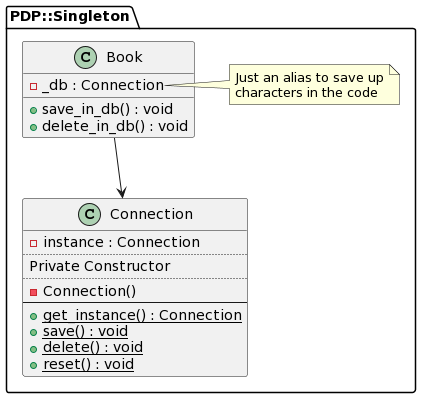

Singleton Pattern
===

From: https://refactoring.guru/design-patterns/singleton

> Singleton is a creational design pattern that lets you ensure that a class has only one instance, while providing a global access point to this instance.

---

Table of Contents
===

- [Implementation Details](#implementationddetails)
- [UML Goodies](#uml-goodies)
  - [State Diagram](#state-diagram)
  - [Class Diagram](#class-diagram)

---

Implementation Details
===

A dummy example representing a Database connection. The requirement is that
there's only one database connection per process.

All collaborators of this class don't have access to how the connection is
established or managed, just get access to the operations instead.

The operations defined are:

* Save to the DB
* Delete from the DB.

Singleton in Perl is a fun exercise to learn how [`ref`][perldoc-ref] and
[`state`][perldoc-state] works.

The sweet sauce is on methods `singleton` and `get_instance`.

The former will create a global instance using [`state`][perldoc-state], and the
latter will make sure that only that instance is used.

[See the source](../../lib/PDP/Singleton/Connection.pm) for extra in-depth commentary.

[perldoc-ref]: https://perldoc.perl.org/functions/ref
[perldoc-state]: https://perldoc.perl.org/functions/state

UML Goodies
===

Class Diagram
---

