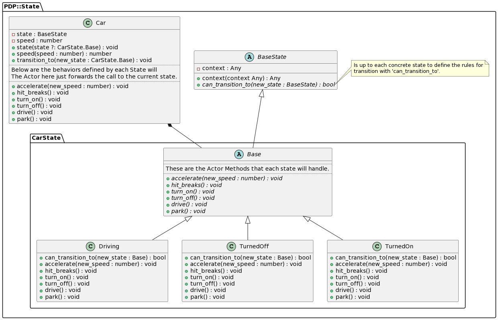

<!-- MarkdownTOC -->

- State Pattern
- UML Goodies
  - State Diagram
  - Class Diagram

<!-- /MarkdownTOC -->

State Pattern
===

From: https://refactoring.guru/design-patterns/state

> State is a behavioral design pattern that lets an object alter its behavior when
its internal state changes. It appears as if the object changed its class.

---

This implementation is a small State Machine representing a `Car` that can:

* Turn on
* Turn off
* Drive
  
    * Accelerate
    * Break

Each State is represented by an _adjetive_ (e.g. `Driving`) and every transition
as a **verb** (`park`, `drive`). I don't know if that's good or bad, but it
works for my understanding of the pattern.

UML Goodies
===

State Diagram
---

Class Diagram
---

